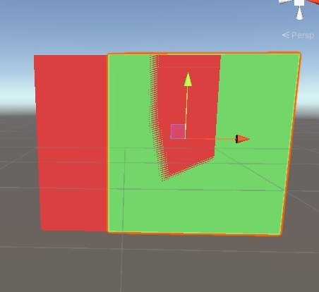

# [渲染命令](https://docs.unity3d.com/Manual/SL-Pass.html)
## 说明
- 语法位置：Pass /Subshader中都可，注意：Pass {渲染命令 CGPROGRAM ... ENDCG}
- 可否更改：这个渲染命令是底层的支持，上层无法增加。Tags是可以自定义的，因为他是Unity引擎增加的。
- 可设置否：可设置简单的一些参数，但对于实际需要是够的。
## Cull - 剔除
-  Cull Back | Front | Off
-  控制应该剔除多边形的哪些面（不绘制）。  Back 不渲染背离观察者的多边形_（默认值）_。
## ZTest - 深度测试
- ZTest (Less | Greater | LEqual(默认) | GEqual | Equal | NotEqual | Always)
- 设置深度缓冲区测试模式。
- 描述： 应如何执行深度测试。默认值为 _LEqual_（将前方或远处的对象作为现有对象绘制；隐藏其后面的对象）。
- 说明：通过后会把颜色写入，深度是否写入取决于ZWrite。
## ZWrite - 深度写入
- ZWrite On | Off
- 设置深度缓冲区写入模式。 
- 控制是否将此对象的像素写入深度缓冲区（默认值为 _On_）。如果要绘制实体对象，请将其保留为 on。如果要绘制半透明效果，请切换到 ZWrite Off。
- 开关与否：颜色都会在ZTest通过渲染出来。
- 说明：ZTest之后，深度是否写入取决于这个。
- 深度的目的？物体深度的比较值，不过怎么渲染颜色。 
## Offset - 偏移
- Offset [_OffsetFactor], [_OffsetUnits]
- 设置 Z 缓冲区深度偏移。
- [原理文档](https://blog.csdn.net/linjf520/article/details/94596104)
- 比较方式：两个物体物体，重叠，默认：OffsetFactor=0，_OffsetUnits=0。 所以没有声明这个的时候会出现闪烁的。 
- 描述：两个值决定了深度偏移（公式计算），用于屏幕空间的像素深度。
- 表达形式  Offset factor,units   或者属性定义 Offset [_factor],[_units]
- 公式：S*factor + D*_units  其实相同的factor/_units 越小就可以最后值越小，模型渲染的越靠前(和深度写入一样，越小越靠前，当然只是默认情况下)，但是模型位置不会改变，只是在裁剪的时候去运用到这个偏移数据。
- 解决的问题？ 一般用来处理R{两个模型重叠部分}R导致的z-fighting(重叠部分闪烁问题)，不改变物体实际位置，渲染输出的时候，深度偏移,改动较小的情况下，解决重叠闪烁问题。
- 
## Blend - 混合
- =========================== G<基本的语法形式>G============================
- 1.R{ Blend sourceBlendMode destBlendMode }R
- 2.R{ Blend sourceBlendMode destBlendMode, alphaSourceBlendMode alphaDestBlendMode}R
- 3.R{ BlendOp colorOp}R
- 4.R{ BlendOp colorOp, alphaOp}R
- ============================ G<混合系数 Blend>G============================
- R{One}R: 值为1
- R{Zero}R: 值为0
- R{SrcColor}R: 当前颜色rgb 
- R{SrcAlpha}R:当前Alpha
- R{DstColor}R:帧缓存颜色rgb
- R{DstAlpha}R:帧缓存颜色a
- R{OneMinusSrcColor}R:1-SrcColor
- R{OneMinusSrcAlpha}R:1-SrcAlpha
- R{OneMinusDstColor}R:1-DstColor
- R{OneMinusDstAlpha}R:1-DstAlpha
- ============================ G<BlendOp>G============================
- R{Add:Src+Dst}R:当前色 + 缓存色
- R{Sub:Src-Dst}R:当前色 - 缓存色
- R{ RevSub:Dst-Src}R: 缓存色 - 当前色
- R{Min:min(src,dst)}R: 缓存色和当前色的比较较小的输出
- R{Max:max(src,dst)}R:同上相反
- 其他DX11的特别逻辑，参考文档
- ============================== G<详细说明>G============================
- 描述：执行完所有着色器后，渲染到屏幕的像素Src 与已有像素（已经写入缓存的像素Dst）的混合方式。
- 顺序:当前色 -- 已经缓存的色 
- 注意混合系数（Blend） 和 混合运算两个 (BlendOp)
- 优化： GrabPass 的有些效果可以用Blend 实现，因为性能更高。单纯改变颜色这种或者透明度可以，除非是特别的扭曲等改变已缓存像素的模糊等。
- ============================ G<Blend 和 BlendOp区别>G============================
- Blend：制作数据
- BlendOp:缓存数据和当前数据的混合形式，+-等。
- SrcFactor*系数1+ DstFactor*系数2  如：One DstColor 结果=SrcFactor * One + DstFactor * DstColor
- 普通透明计算：当前颜色*alpha + 帧缓冲*alpha  写成： Blend  SrcAlpha OneMinusSrcAlpha 解释：除了自己的颜色，剩余显示.
- =========================== G<AlphaToMask On | Off>G============================
- 设置 Alpha 混合、Alpha 操作和 alpha-to-coverage 模式。参考G<[Alpha 混合、Alpha 测试和 alpha_to_coverage]>G。  
## ColorMask - 颜色遮罩
-  ColorMask RGB | A | 0 | R、G、B、A 的任意组合
-  设置颜色通道写入遮罩。写入 ColorMask 0 可关闭对所有颜色通道的渲染。默认模式是 写入所有通道 (RGBA)，但是对于某些特殊效果，您可能希望不修改某些通道，或完全禁用颜色 写入。
-  使用多渲染目标 (MRT) 渲染时，可通过在末尾添加索引（0 到 7）来为每个渲染目标设置不同的颜色遮罩。例如，ColorMask RGB 3 将使渲染目标 #3 仅写入到 RGB 通道。
-------
# Alpha 混合、Alpha 测试和 alpha_to_coverage
## 这几种是处理完全透明或者完全不透明的方法  如：其中透明度由纹理的 Alpha 通道定义，例如树叶、草、铁丝网等。
## Alpha 混合：
- 表示位置：[SubShader]   如 Blend SrcAlpha  OneMinusSrcAlpha
- 原理/条件：也就是Blend 对alpha造成的影响，当然混合还需要Tag配合
## Alpha 测试/镂空：
- 表示位置：[frag方法中]   clip()
- 原理/条件：通过像素着色器(frag) 中的clip直接放弃某个像素点处理，这样做到完全不透明，并且忽略了顺序问题。但也意味着像素要么完全透明要么完全不透明，导致锯齿问题。
## alpha_to_coverage
- 表示位置：[Pass]  Pass{Tag  AlphaToMask On  CGPROGRAME ... ENDCG  }
- 原理/条件： MSAA开启，并且 Tags { "Queue"="AlphaTest" "RenderType"="TransparentCutout" "IgnoreProjector"="True" }
                       可通过使用 alpha-to-coverage GPU 功能来改进 Alpha 测试方法。根据使用的 MSAA 级别，这将改善边缘外观。