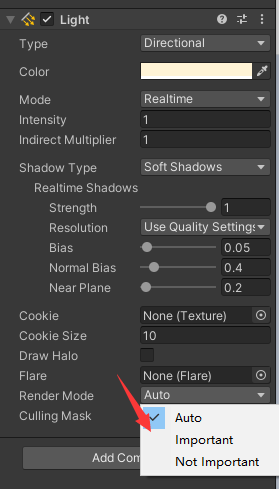

# [官方文档](https://docs.unity3d.com/Manual/SL-UnityShaderVariables.html)
## 参考图
- RenderMode 
# 说明 - 常用常量/变量
## 介绍
- 矩阵 +  时间 + 光照数据
- 常量：是全大写 变量：unity_/_  开头。  unity一般是unity的变化
- 变量：来自场景内数据
- 
# 常用变换矩阵 
## UNITY_MATRIX_MVP	
- 当前模型 * 视图 * 投影矩阵。
## UNITY_MATRIX_MV	
- 当前模型 * 视图矩阵。
## UNITY_MATRIX_V	
- 当前视图矩阵。
## UNITY_MATRIX_P	
- 当前投影矩阵。
## UNITY_MATRIX_VP	
- 当前视图 * 投影矩阵。
## UNITY_MATRIX_T_MV	
- 模型转置 * 视图矩阵。
## UNITY_MATRIX_IT_MV	
- 模型逆转置 * 视图矩阵。
## unity_ObjectToWorld	
- 当前模型矩阵。
## unity_WorldToObject	
- 当前世界矩阵的逆矩阵。
----
# 时间-处理跟随时间变化的着色器
## _Time
- 类型：float4
- 常用：_Time.y
- 分量数据：(x,y,z,w)=(t/20,t,t*2,t*3)  
## _SinTime /_CosTime
- 类型：float4
- 常用：_SinTime.w  , _CosTime.w
- 分量数据：(x,y,z,w)=(t/8,t/4,t/2,t)

## unity_DeltaTime
- 类型：float4
- 常用：unity_DeltaTime.x
- 增量时间：(x,y,z,w)=(dt, 1/dt, smoothDt, 1/smoothDt)
-----
# 光照说明
## 说明
- 设置方式：ProjectSettings/Graphics 统一设置  或者 所属相机的渲染方式 RenderingPath 单独设置
- 两种方式的区别:点击说明跳转链接
- 描述：光源参数以不同的方式传递给着色器，具体取决于使用哪个渲染路径， 以及着色器中使用哪种光源模式通道标签。
- 决定方式：Camera.RenderingPath + Shader的RenderingPath Tag
## [渲染路径参考文档](https://docs.unity3d.com/Manual/RenderingPaths.html)

# 光照 - 前向渲染(forward)
## 内容介绍
- 包含：前向渲染（ForwardBase 和 ForwardAdd 通道类型）
- 主要是：场景内灯光的颜色，位置，不单单是主光源还有当前Shader周围的其他光源。
##  _LightColor0（在 Lighting.cginc 中声明）
- fixed4
- 主光源颜色，一般是最近的那一个，或者光源组件的RenderMode=Important
## _WorldSpaceLightPos0	
- float4	
- 方向光：（世界空间方向，0）。其他光源：（世界空间位置，1）。
## _LightMatrix0（在 AutoLight.cginc 中声明）	
- float4x4	
- 世界/光源矩阵。用于对剪影和衰减纹理进行采样。
## unity_4LightPosX0、unity_4LightPosY0、unity_4LightPosZ0	
- float4	
- （仅限 ForwardBase 通道 ）前四个非重要点光源的世界空间位置。   
- Tags{"LightMode"="ForwadBase"}
- 光源组件的RenderMode=Not Important
## unity_4LightAtten0	
- float4	
- （仅限 ForwardBase 通道）前四个非重要点光源的衰减因子。
- Tags{"LightMode"="ForwadBase"}
## unity_LightColor	half4[4]	
- （仅限 ForwardBase 通道）前四个非重要点光源的颜色。
- Tags{"LightMode"="ForwadBase"}
## unity_WorldToShadow	
- float4x4[4]	
- 世界/阴影矩阵。聚光灯的一个矩阵，方向光级联最多有四个矩阵。
-----
# 光照 - 延迟渲染（Deferred）
## 说明
- 延迟着色和延迟光照，在光照通道着色器中使用（全部在 UnityDeferredLibrary.cginc 中声明）：
## _LightColor 	
- float4	
- 光源颜色。
## _LightMatrix0	
- float4x4	
- 世界/光源矩阵。用于对剪影和衰减纹理进行采样。
## unity_WorldToShadow	
- float4x4[4]	
- 世界/阴影矩阵。聚光灯的一个矩阵，方向光级联最多有四个矩阵。
------
# 光照 - 顶点(Vertex)
## 说明：
- 最多可为 Vertex 通道类型设置 8 个光源；始终从最亮的光源开始排序。
- 如果您希望 一次渲染受两个光源影响的对象，可直接采用数组中前两个条目。如果影响对象 的光源数量少于 8，则其余光源的颜色将设置为黑色。
## unity_LightColor	
- half4[8]	
- 光源颜色。
##  unity_LightPosition	
- float4[8]	
- 视图空间光源位置。方向光为 (-direction,0)；点光源/聚光灯为 (position,1)。
##  unity_LightAtten	
- half4[8]	
- 光源衰减因子。x 是 cos(spotAngle/2) 或 –1（非聚光灯）；_y_ 是1/cos(spotAngle/4) 或 1（非聚光灯）；_z_ 是二次衰减；_w_ 是平方光源范围。
##  unity_SpotDirection	
- float4[8]	
- 视图空间聚光灯位置；非聚光灯为 (0,0,1,0)。

